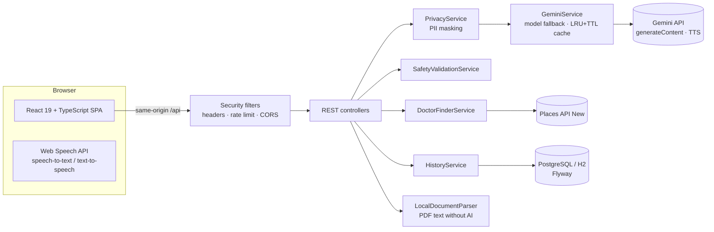

# ArogyaLens

**See. Understand. Hear. Act.**

The AI accessibility layer for healthcare.

ArogyaLens helps people understand medical reports, prescriptions, medicine packages, and discharge documents — without pretending to diagnose or replace a doctor.

---

## Problem

In India, a lab report, prescription or discharge summary is usually handed over in dense medical English. For hundreds of millions of people that is a real barrier to care:

- **Language:** most patients think and speak in Hindi, Kannada, Tamil, Telugu, Marathi, Bengali or another regional language, not clinical English.
- **Literacy:** many patients and caregivers have limited reading or health literacy, and some have low vision.
- **Access:** doctors are scarce outside cities, consultations are short, and people don't know which specialist to see.
- **Trust and safety:** generic chatbots can sound certain, invent sources or give unsafe medication advice.

## How ArogyaLens addresses it

| Barrier | Feature |
|---|---|
| Technical language | Gemini reads photos/PDFs and explains every value in plain words; "Explain like I'm 12" |
| Language | Answers, explanations and voice in 7 Indian languages; ask in any script and get the answer in that language |
| Literacy and vision | Read-aloud (device voice or Gemini TTS), voice questions, accessibility mode with large text |
| Knowing what to do next | Questions to ask the doctor, family summary to share, doctor finder with the right specialist and real nearby clinics |
| Safety | Never diagnoses or changes medicines; red-flag symptoms show 108/112; trusted sources only |
| Privacy | Personal identifiers are masked before AI and storage; history is opt-in and deletable |

## Solution

ArogyaLens is an **AI accessibility layer between healthcare information and the patient**:

> **See → Understand → Translate → Hear → Verify → Prepare → Act**

It explains what documents say, translates meaning carefully, reads aloud, cites trusted sources, and prepares questions for a healthcare professional.

> We don't replace the doctor. We make healthcare easier to understand.

---

## Features

- **Medical report scanner** — multimodal understanding of labs (tables, values, units, ranges)
- **Privacy Shield** — detects and masks common PII before AI processing
- **Structured health dashboard** — within / discuss / important attention (non-diagnostic)
- **Medical term explainer** + **Explain like I'm 12**
- **Multilingual explanations** — English, Hindi, Kannada, Tamil, Telugu, Marathi, Bengali
- **Voice accessibility** — listen (TTS) and ask by voice (browser STT + backend Q&A)
- **Ask my doctor** — grounded question lists with copy/share
- **Evidence / trust layer** — WHO, MoHFW, AIIMS, IPC, CDSCO links (no fabricated citations)
- **Medicine scanner** — general informational medicine context
- **Prescription interpreter** + visual morning/afternoon/night schedule
- **Discharge summary mode**
- **Family summary** and **Accessibility mode**
- **Real document upload** — JPG / PNG / WEBP / PDF recognition (Gemini for images; local PDF text parsing without AI)
- **AI safety layer** — blocks diagnosis claims and medication-change instructions
- **Ask anything bar with mic** — on every page, answers in the language you speak (7 Indian languages)
- **Find a doctor** — suggests the right specialist and finds real nearby doctors (Google Places) or opens Google Maps / Practo / eSanjeevani; never invents doctors; 108/112 emergency banner
- **My history (opt-in)** — PII-masked scans and questions, delete one or all


---

## Architecture



One container: Spring Boot serves the built React app (with SPA fallback) and the `/api` endpoints.

## Technology stack

| Layer | Tech |
|---|---|
| Frontend | React 19, TypeScript (strict), Vite, Tailwind CSS 4, React Router (lazy routes) |
| Backend | Java 21, Spring Boot 3.3 (Web, Validation, Data JPA, Actuator), PDFBox |
| AI | Google Gemini (`gemini-flash-latest` + fallback chain), Gemini TTS |
| Data | PostgreSQL via `DATABASE_URL` (TLS) or in-memory H2; Flyway migrations |
| Quality | JUnit 5, MockMvc, MockRestServiceServer, JaCoCo, Spotless, Checkstyle · Vitest, Testing Library, axe, ESLint (jsx-a11y), Prettier |
| Delivery | Docker (non-root), Render blueprint, GitHub Actions CI, CodeQL, Dependabot |

## Google services

| Service | How ArogyaLens uses it |
|---|---|
| **Gemini API** (`generateContent`) | Reads report/medicine/prescription/discharge photos and PDFs, explains them in plain language, answers questions in 7 languages, suggests the right specialist. Falls back across models on 429/404/5xx/timeouts. |
| **Gemini TTS** (`gemini-2.5-flash-preview-tts`) | Reads answers aloud when the device has no voice for the chosen language. |
| **Places API (New)** `places:searchText` | Real nearby doctors and clinics (name, rating, phone, open now) when `GOOGLE_MAPS_API_KEY` is set. |
| **Google Maps URLs** | Deep links for directions and searches when no Maps key is configured. |
| **Web Speech API** (Chrome) | Voice input and speech output in Indian locales. |
| **Google Fonts — Noto** | Correct rendering of Devanagari, Kannada, Tamil, Telugu and Bengali scripts. |

## Project structure

```text
.
├── backend/                     Spring Boot API (serves the built frontend in production)
│   ├── src/main/java/com/arogyalens/
│   │   ├── ai/                  GeminiService, PromptLibrary, AiResponseCache, AiErrors
│   │   ├── config/              Typed properties, WebConfig (CORS, SPA fallback), DATABASE_URL resolver
│   │   ├── controller/          REST controllers (scan, voice/chat/TTS, translate, safety, health)
│   │   ├── doctor/              Specialty suggestion + Places doctor finder
│   │   ├── history/             Opt-in PII-masked history (JPA)
│   │   ├── privacy/ safety/     PII masking and medical safety rules
│   │   ├── security/            Security headers + per-IP rate limiting filters
│   │   ├── service/             Document, medicine, prescription, discharge, session, voice services
│   │   ├── dto/ model/          Records for requests/responses and domain types
│   │   └── exception/           Single GlobalExceptionHandler with stable error codes
│   └── src/main/resources/db/migration/   Flyway SQL
├── frontend/                    React SPA
│   └── src/{api,components,context,hooks,lib,pages,types,test}
├── .github/                     CI, CodeQL, Dependabot
├── Dockerfile                   Multi-stage build → single runtime container
├── render.yaml                  Render blueprint
└── .env.example                 Every configuration variable (no secrets)
```

## Setup

Prerequisites: Java 21, Maven 3.9+, Node.js 20.19+.

```bash
cp .env.example .env            # add GEMINI_API_KEY (and optional keys); .env is git-ignored
./scripts/start-backend.sh      # http://localhost:8088
./scripts/start-frontend.sh     # http://localhost:5173 (proxies /api)
```

Text-based PDF lab reports work without Gemini; photos need `GEMINI_API_KEY`.

### Environment variables

| Variable | Default | Purpose |
|---|---|---|
| `GEMINI_API_KEY` | — | Gemini key (required for photo scans and AI answers) |
| `GEMINI_MODEL` | `gemini-flash-latest` | Primary model |
| `GEMINI_FALLBACK_MODELS` | `gemini-flash-latest,gemini-flash-lite-latest,…` | Tried in order on 429/404/5xx/timeout |
| `GEMINI_TTS_MODEL` | `gemini-2.5-flash-preview-tts` | Cloud read-aloud fallback |
| `AI_ENABLED` / `AI_TIMEOUT_MS` | `true` / `45000` | Toggle AI, request timeout |
| `AI_CACHE_MAX_ENTRIES` / `AI_CACHE_TTL_SECONDS` | `200` / `900` | Identical-request cache |
| `GOOGLE_MAPS_API_KEY` | — | Enables live doctor listings (Places API New) |
| `DATABASE_URL` / `DATABASE_SSLMODE` | — / `require` | PostgreSQL for history (else in-memory H2) |
| `HISTORY_ENABLED` / `HISTORY_MAX_ENTRIES` | `true` / `50` | History feature and per-device cap |
| `ALLOWED_ORIGINS` | localhost dev origins | Extra CORS origins |
| `RATE_LIMIT_PER_MINUTE` | `20` | Per-IP budget for AI endpoints |
| `DEMO_ENABLED` | `false` | Sample documents without uploads |
| `PORT` / `SERVER_PORT` | `8088` | HTTP port (`PORT` is injected by Render/Cloud Run) |
| `VITE_API_URL` | empty | Frontend build: API base URL (empty = same origin) |

## Testing

```bash
cd backend  && mvn verify                 # tests + JaCoCo gate + Spotless + Checkstyle
cd frontend && npm run lint && npm run typecheck && npm run format:check \
            && npm run test:coverage && npm run build
```

- **Backend:** unit tests for Gemini (fallback chain, timeouts, error mapping, cache), sessions, voice, safety, PII masking, upload sniffing, rate limiting, doctor finder, `DATABASE_URL` parsing; MockMvc API tests including edge cases (empty/oversized/unsupported input, 404/405, AI off) and the history flow on H2. All HTTP to Google is mocked.
- **Frontend:** Vitest + Testing Library + axe for the ask bar, doctor finder, upload, history, every route and every results type (fixtures captured from the backend's demo mode); coverage thresholds enforced.
- CI (`.github/workflows/ci.yml`) runs both suites and a Docker build on every push and pull request.

## Deployment

**Render:** create a Web Service from this repo (Docker runtime) or use `render.yaml`. Set `GEMINI_API_KEY` and `GEMINI_MODEL=gemini-flash-latest`; optionally `GOOGLE_MAPS_API_KEY` and `DATABASE_URL`. Health check: `/api/health`.

**Cloud Run:**
```bash
gcloud run deploy arogyalens --source . --region asia-south1 --allow-unauthenticated \
  --set-env-vars GEMINI_MODEL=gemini-flash-latest --set-secrets GEMINI_API_KEY=gemini-key:latest
```

## Security

See [SECURITY.md](SECURITY.md). Highlights: PII masking before AI and before storage, magic-byte upload validation and size limits, length-limited validated inputs, per-IP rate limiting, CSP and other security headers, env-driven CORS, no stack traces in responses, keys only in headers, non-root container, CodeQL and Dependabot.

## Accessibility

Skip link and landmarks, labelled controls, visible focus, keyboard-operable accordions, `lang` follows the chosen language, live regions for AI answers, reduced-motion support, WCAG AA contrast, large-text accessibility mode, read-aloud in 7 languages, and axe checks in the test suite.

## Privacy and safety

- PII (names, phone numbers, emails, ID numbers) is masked before AI processing, in sessions and in history. Sessions are in memory and expire; uploads are not stored.
- History is opt-in, keyed by an anonymous device id, and deletable.
- `SafetyValidationService` blocks diagnosis claims and medication start/stop/dose instructions, and red-flag symptoms surface the 108/112 emergency banner.

## API

```text
GET    /api/health
POST   /api/documents/analyze | /api/medicines/analyze | /api/prescriptions/analyze | /api/discharge/analyze
POST   /api/voice/query   POST /api/chat   POST /api/voice/tts
POST   /api/translate     POST /api/doctor-questions   POST /api/safety/validate
POST   /api/doctors/specialty   POST /api/doctors/search
GET    /api/sources   GET /api/sources/{id}
GET    /api/history   DELETE /api/history   DELETE /api/history/{id}   (X-Device-Id header)
```

## Limitations

- Not a medical device; not for emergencies or clinical decisions.
- PII detection covers common patterns, not every identifier.
- Browser speech quality depends on the device's installed voices.

## License

[MIT](LICENSE). Built for PromptWars × H2S — AI for Healthcare Accessibility.
