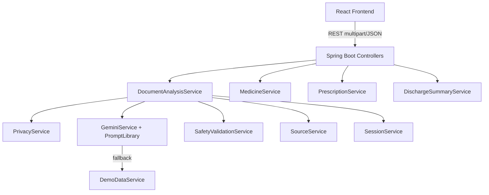
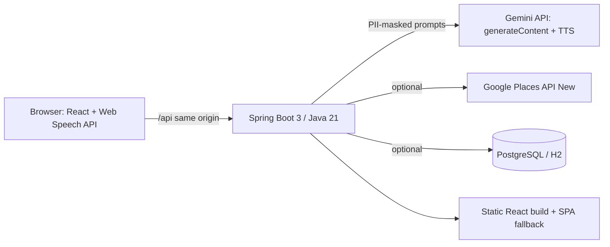

# ArogyaLens

**See. Understand. Hear. Act.**

The AI accessibility layer for healthcare.

ArogyaLens helps people understand medical reports, prescriptions, medicine packages, and discharge documents — without pretending to diagnose or replace a doctor.

---

## Problem

Healthcare information is available, but many people cannot understand it because it is too technical, written only in English, difficult to read, or presented in a format that is not accessible to them.

## Solution

ArogyaLens is an **AI accessibility layer between healthcare information and the patient**:

> **See → Understand → Translate → Hear → Verify → Prepare → Act**

It explains what documents say, translates meaning carefully, reads aloud, cites trusted sources, and prepares questions for a healthcare professional.

> We don't replace the doctor. We make healthcare easier to understand.

---

## Features

- **Medical report scanner** — multimodal understanding of labs (tables, values, units, ranges)
- **Privacy Shield** — detects and masks common PII before AI processing
- **Structured health dashboard** — within / discuss / important attention (non-diagnostic)
- **Medical term explainer** + **Explain like I'm 12**
- **Multilingual explanations** — English, Hindi, Kannada, Tamil, Telugu, Marathi, Bengali
- **Voice accessibility** — listen (TTS) and ask by voice (browser STT + backend Q&A)
- **Ask my doctor** — grounded question lists with copy/share
- **Evidence / trust layer** — WHO, MoHFW, AIIMS, IPC, CDSCO links (no fabricated citations)
- **Medicine scanner** — general informational medicine context
- **Prescription interpreter** + visual morning/afternoon/night schedule
- **Discharge summary mode**
- **Family summary** and **Accessibility mode**
- **Real document upload** — JPG / PNG / WEBP / PDF recognition (Gemini for images; local PDF text parsing without AI)
- **AI safety layer** — blocks diagnosis claims and medication-change instructions

---

## Architecture



### Backend package layout

```text
com.arogyalens
 ├── controller
 ├── service
 ├── dto
 ├── model
 ├── config
 ├── ai
 ├── privacy
 ├── safety
 ├── source
 ├── demo
 ├── exception
 └── util
```

---

## Technology Stack

| Layer | Tech |
|-------|------|
| Frontend | React, TypeScript, Vite, Tailwind CSS |
| Backend | Java 21, Spring Boot 3.3 |
| AI | Google Gemini (optional; demo works offline) |
| Privacy / Safety | Custom Java services |

---

## Setup

### Prerequisites

- Node.js 20+
- Java 21
- Maven 3.9+

### Environment Variables

Copy `.env.example` to `.env` in the project root (and/or export variables):

| Variable | Description |
|----------|-------------|
| `GEMINI_API_KEY` | Google Gemini API key (**required for image recognition**) |
| `GEMINI_MODEL` | Default `gemini-2.0-flash` |
| `AI_ENABLED` | `true` / `false` |
| `SERVER_PORT` | Backend port (default `8088`) |
| `VITE_API_URL` | Backend URL; leave empty to use Vite proxy |

**Never commit real API keys.**

---

## Running Locally

### Backend

```bash
cd backend
# Copy root .env.example → .env and set:
export GEMINI_API_KEY=your_key_here   # required for photos/images
mvn -Dmaven.repo.local=../.m2 spring-boot:run
```

API: `http://localhost:8088` (override with `SERVER_PORT`)

### Frontend

```bash
cd frontend
npm install
npm run dev
```

App: `http://localhost:5173`

### Upload flow

1. Choose language in the header
2. Open **Scan a report** (or Medicine / Prescription / Discharge)
3. Upload a JPG/PNG/WEBP/PDF and click **Analyze document**
4. Review Privacy Shield → structured results → switch language → Listen

**Note:** Text-based lab PDFs work without Gemini. Photos of reports/medicines need `GEMINI_API_KEY` in `.env`, then restart the backend.

### Tests

```bash
cd backend
mvn test
```

---

## Privacy

- Minimal collection; sessions are in-memory and expire
- Common PII patterns are masked before AI processing where detected
- Uploaded files are processed temporarily and **not stored permanently by default**
- Medical document contents are not written to application logs
- We do **not** claim “your data can never be stored”

Wording used in product:

> ArogyaLens automatically detects and masks common personal identifiers before processing.

---

## Safety

`SafetyValidationService` reviews outbound text to reduce:

- Unsupported diagnosis claims (“You have diabetes”)
- Medication start/stop/dose-change instructions

Sensitive findings surface:

> ⚠️ Important — ArogyaLens cannot diagnose your condition or determine treatment from this document alone.

---

## Limitations

- Prototype for hackathon / early product validation
- PII detection covers common patterns, not every identifier
- Without `GEMINI_API_KEY`, image uploads cannot be recognized (text PDFs still work)
- Browser speech recognition/TTS quality depends on the device and OS voices
- Not a medical device; not for emergencies or clinical decision-making

---

## Future Roadmap

- On-device OCR + redaction pipeline for stronger privacy
- Clinician-verified explanation templates per lab panel
- Caregiver / family shared sessions with consent
- Offline-first language packs for rural connectivity
- Hospital EHR integration with explicit patient authorization

---

## API Overview

```text
POST /api/documents/analyze
POST /api/medicines/analyze
POST /api/prescriptions/analyze
POST /api/discharge/analyze
POST /api/translate
POST /api/voice/query
POST /api/chat
POST /api/doctor-questions
POST /api/safety/validate
GET  /api/sources/{id}
GET  /api/health
```

---

## License

Built for PromptWars — AI for Healthcare Accessibility.

---

## H2S submission notes

### Architecture


### Google services
| Service | Use |
|---|---|
| Gemini (`gemini-flash-latest` + fallback chain) | Report/medicine/prescription/discharge understanding, multilingual Q&A, specialty suggestion |
| Gemini TTS (`gemini-2.5-flash-preview-tts`) | Read-aloud fallback when the device has no voice for the language |
| Places API (New) `places:searchText` | Real nearby doctors when `GOOGLE_MAPS_API_KEY` is set; otherwise Google Maps / Practo / eSanjeevani deep links (never fake doctors) |
| Web Speech API (Chrome) | Voice input and speech output in 7 Indian languages |
| Google Fonts (Noto Sans + Indic) | Readable scripts for all supported languages |

### Testing
- Backend: `cd backend && mvn test` — JUnit 5 + MockMvc + MockRestServiceServer (Gemini fallback/timeout/errors, cache, sessions, voice, safety, PII, uploads, rate limit, doctor finder, history, API integration). No real API calls.
- Frontend: `cd frontend && npm run lint && npm run typecheck && npm test` — Vitest + React Testing Library + axe.
- CI: `.github/workflows/ci.yml` runs both plus the Docker build.

### Security
See [SECURITY.md](SECURITY.md): PII masking before AI and storage, magic-byte upload checks, per-IP rate limit, security headers, env-based CORS, no stack traces, non-root container.

### Accessibility
Skip link, semantic landmarks, labelled controls, visible focus, keyboard-operable accordions, `lang` follows the selected language, live regions for AI answers, reduced-motion support, AA contrast, emergency 108/112 banner, axe checks in tests.

### Efficiency
LRU + TTL cache for identical AI requests, rules-first specialty mapping, client-side image downscaling, lazy routes, gzip, long-cache hashed assets.

### Environment variables (new)
`GEMINI_MODEL` (default `gemini-flash-latest`), `GEMINI_FALLBACK_MODELS`, `GEMINI_TTS_MODEL`, `AI_TIMEOUT_MS`, `GOOGLE_MAPS_API_KEY`, `ALLOWED_ORIGINS`, `RATE_LIMIT_PER_MINUTE`, `DATABASE_URL`, `DATABASE_SSLMODE`, `HISTORY_ENABLED`. See `.env.example`.

### API
`GET /api/health` · `POST /api/documents|medicines|prescriptions|discharge/analyze` · `POST /api/voice/query` · `POST /api/chat` · `POST /api/voice/tts` · `POST /api/doctors/specialty` · `POST /api/doctors/search` · `GET/DELETE /api/history[/{id}]` · `POST /api/translate` · `POST /api/safety/validate`
